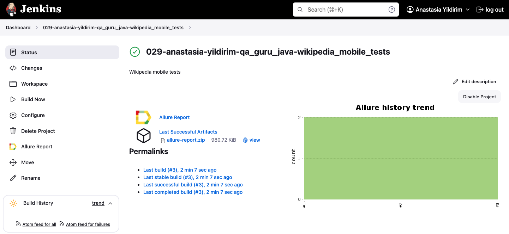
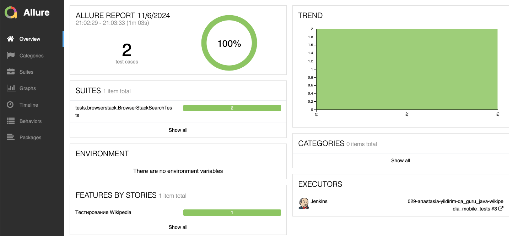
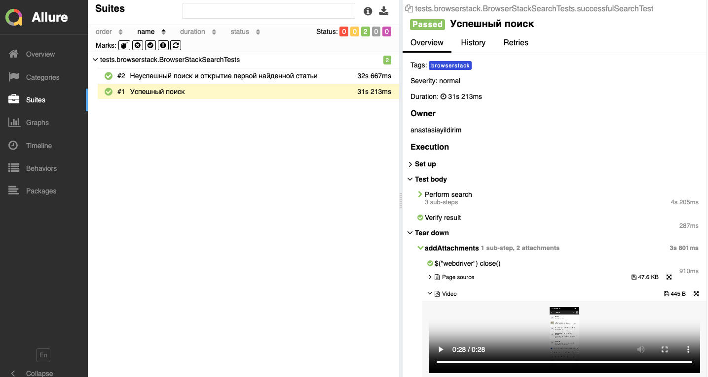
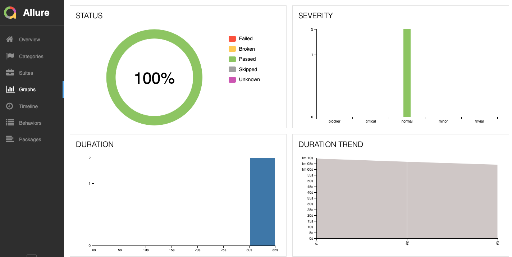
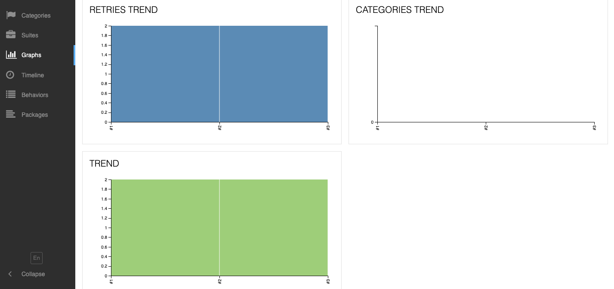
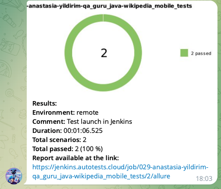
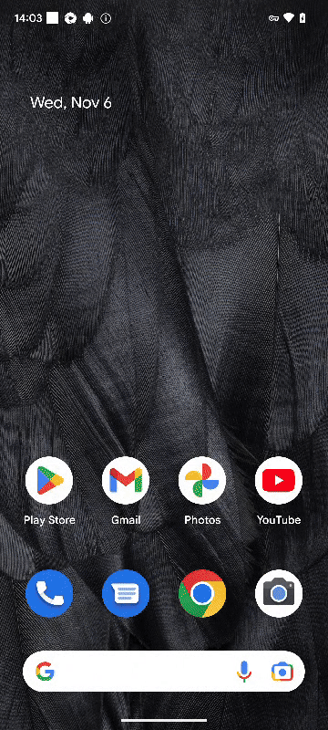
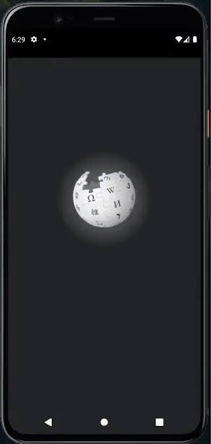

# Проект по автоматизации тестирования для мобильного приложения [Wikipedia](https://wikipedia.com/) для Android

> Википедия — это свободная онлайн-энциклопедия, редактируемая пользователями со всего мира, которая предоставляет бесплатный доступ к информации по множеству тем.

## **Содержание:**
____

* <a href="#tools">Технологии и инструменты</a>

* <a href="#cases">Примеры автоматизированных тест-кейсов</a>

* <a href="#jenkins">Сборка в Jenkins</a>

* <a href="#console">Запуск из терминала</a>

* <a href="#allure">Allure отчет</a>

* <a href="#telegram">Уведомление в Telegram при помощи бота</a>

* <a href="#video">Примеры видео выполнения тестов на Selenoid</a>
____
<a id="tools"></a>
## <a name="Технологии и инструменты">**Технологии и инструменты:**</a>

<p align="center">  
<a href="https://www.java.com/"></a>  
<a href="https://www.jetbrains.com/idea/"> </a> 
<a href="https://www.android.com/"></a> 
<a href="https://developer.android.com/studio"></a>
<a href="https://git-scm.com/"></a> 
<a href="https://junit.org/junit5/"></a> 
<a href="https://rest-assured.io/"></a>
<a href="https://gradle.org/"></a>  
<a href="https://selenide.org/"></a>   
<a href="ht[images](images)tps://github.com/allure-framework/allure2"></a>    
<a href="https://www.jenkins.io/"></a>  
<a href="https://www.browserstack.com/">  </a>
<a href="https://appium.io/"></a>  
</p>

____
<a id="cases"></a>
## <a name="Примеры автоматизированных тест-кейсов">**Примеры автоматизированных тест-кейсов:**</a>
____
- ✓ *Успешный поиск*
- ✓ *Неуспешный поиск*
- ✓ *Пропуск онбординга нового пользователя*
- ✓ *Успешное прохождение онбординга*
____
<a id="jenkins"></a>
## </a><a name="Сборка"></a>Сборка в [Jenkins](https://jenkins.autotests.cloud/job/029-anastasia-yildirim-qa_guru_java-wikipedia_mobile_tests/)</a>
____
<p align="center">  
<a href="https://jenkins.autotests.cloud/job/029-anastasia-yildirim-qa_guru_java-wikipedia_mobile_tests/"></a>  
</p>

<a id="console"></a>
## Команды для запуска из терминала
___
***Локальный запуск через BrowserStack:***

```bash  
gradle clean browserstack -DdeviceHost=browserstack -Dusername=ЛОГИН -Dpassword=ПАРОЛЬ
```
Чтобы получить логин и пароль, можно зарегистрироваться на [BrowserStack](https://www.browserstack.com/) (или запустите тесты через Jenkins)


***Локальный запуск через эмулятор:***

```bash  
gradle clean emulator -DdeviceHost=emulator -DdeviceName=ДЕВАЙС -DplatformVersion=ВЕРСИЯ
```
По умолчанию:
- deviceName=Pixel 4 API 30
- platformVersion=11.0


***Удалённый запуск через Jenkins:***
```bash  
clean browserstack -DdeviceHost=browserstack
```

___
<a id="allure"></a>
## </a> <a name="Allure"></a>Allure [отчет](https://jenkins.autotests.cloud/job/029-anastasia-yildirim-qa_guru_java-wikipedia_mobile_tests/3/allure)</a>
___

### *Основная страница отчёта*

<p align="center">  
  
</p>  

### *Тест-кейсы*

<p align="center">  
  
</p>

### *Графики*

  <p align="center">  


  
</p>

____
<a id="telegram"></a>
## </a> Уведомление в Telegram при помощи бота
____
<p align="center">  
  
</p>

____
<a id="video"></a>
## </a> Примеры видео выполнения тестов на BrowserStack
____
<p align="center">
   
</p>

____
<a id="video"></a>
## Пример видео выполнения тестов локально через эмулятор
____
<p align="center">
   
</p>
